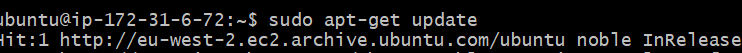
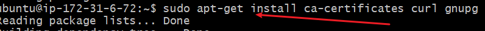
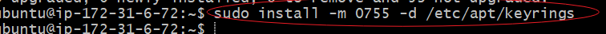
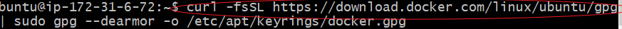
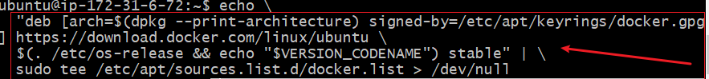
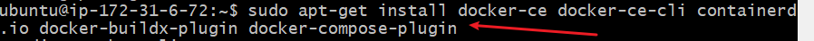
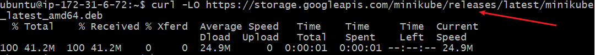
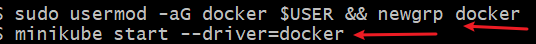

# **Setting up minicube**
## Container Ochestration with kubernetes.
Container orchestration is the automated management of containerized applications across multiple environments. As applications grow in complexity, managing containers manually becomes inefficient. It involves the deployment,scaling and operation of containerised applications, ensuring seamless cordination among multiple containers to deliver high availability and optimal performance.
### Kubernetes
is an open-source container orchestration platform originally developed by Google. It automates key tasks such as:

- Deployment: Launching containers across a cluster of machines.

- Scaling: Automatically adjusting the number of running containers based on demand.

- Load Balancing: Distributing traffic to maintain performance.

- Self-healing: Restarting failed containers and rescheduling them when needed.

- Configuration Management: Managing application settings through declarative YAML files
Kubernetes uses components like Pods (groups of containers), Nodes (machines in the cluster), and Controllers (e.g., Deployments) to manage workloads efficiently. It’s highly extensible and integrates well with cloud providers, CI/CD pipelines, and monitoring tools.
The Kubernetes master node consist of the following tools
- API Server : This serves as the front end for kubernetes control plane. It exposes kubernetes API allowing interaction with the cluster.
- Controller manager: Thia is the component in the control plane that ensures the actual state of teh cluster is the desired state.
- Scheduler: This is the component of the control plane that ensures even distribution of workload to maximise resources.
- etcd: this is a distributed key value store for kubernetes and it used to store configuration details, metadata etc ensuring integrity of cluster information.
- Kubelets: This is component of the node, it is found in every node communiates with the contrl plane to ensure the containers in the pods are running as expected.
- Kube proxy: This is component of the worker node, responsible for network routing and ensuring that the correct network policies are applied.
### Minikube
is a lightweight tool that allows you to run a local Kubernetes cluster on your personal computer. It's primarily used for development, testing, and learning purposes.

Key Features of Minikube:

- Single-node Kubernetes cluster: It simulates a Kubernetes environment using a single VM or container on your local machine.

- Cross-platform: Works on Windows, macOS, and Linux.

- Supports Kubernetes features: Includes features like LoadBalancer, Persistent Volumes, and Dashboard.

- Easy to install and use: With just a few commands, you can start and manage a local cluster.

The following shows how to install *minikube* on an linux.

1. Run the sudo apt-get update
to refresh the package list on debian based system to ensure lastest softeare is available.

2. Next run the linux command that ensures essential packages, certificates,curl and GNU privacy are installed

3. create a directory for storing keyrings files with specific permission (0755).

4. download the docker GPG key by the running below commmand

5. Set read permit for all docker user in GPG file

6. Add repository to Apt sources be 

7. Intsalling the latest version of docker, by running the update command

8. Verify that docker has succesffuly been installed

9. To install Minikube, run the following command

10. Download minicube and install binary using dpkg

11. start minicube with following command--minikube start --driver=docker 

12. download the kubectl to interact with the kubernetes cluster

This marks the end of the project work.
